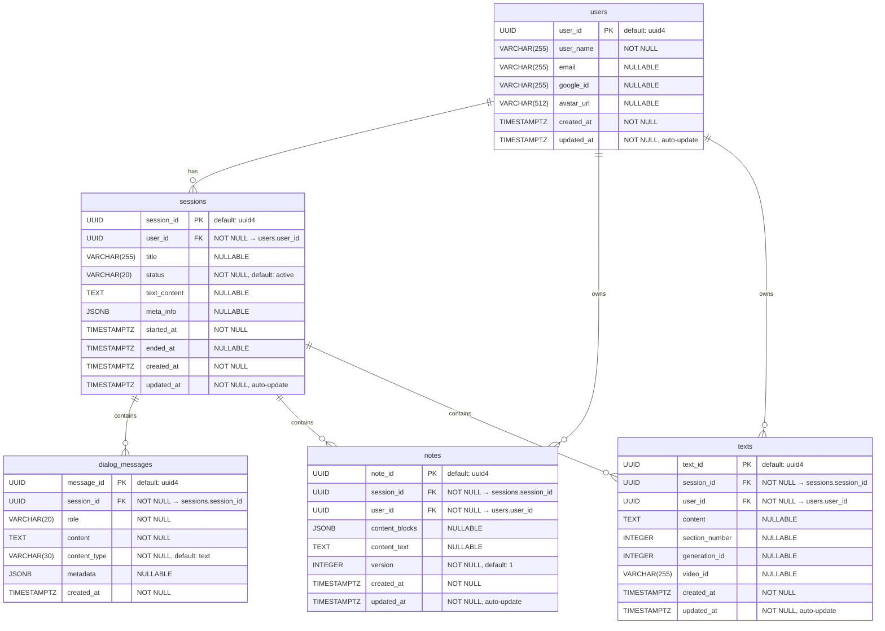

# MathGirl データベース構造

## ER図

## テーブル概要

| テーブル | 説明 | モデルファイル |
|---------|------|--------------|
| `users` | ユーザー情報 (Google OAuth対応) | `back/src/db/models/user.py` |
| `sessions` | 学習セッション | `back/src/db/models/session.py` |
| `dialog_messages` | チャット履歴 (user/assistant) | `back/src/db/models/message.py` |
| `notes` | ノート (JSONB構造化ブロック + テキスト) | `back/src/db/models/note.py` |
| `texts` | テキストコンテンツ (セクション・動画紐付け) | `back/src/db/models/text.py` |

---

## カラム詳細

### users テーブル

ユーザー情報を管理するテーブル。Google OAuthによる認証情報を保持する。

| カラム | 型 | 制約 | 意味 |
|--------|-----|------|------|
| `user_id` | UUID | PK, default: uuid4 | ユーザーの一意識別子 |
| `user_name` | VARCHAR(255) | NOT NULL | ユーザーの表示名。Google OAuthの `name` クレームから取得される。ログインのたびに最新値に更新される |
| `email` | VARCHAR(255) | NULLABLE | ユーザーのメールアドレス。Google OAuthの `email` クレームから取得。現時点ではクエリ検索には使われていない |
| `google_id` | VARCHAR(255) | NULLABLE | GoogleアカウントのサブジェクトID (`sub` クレーム)。`get_by_google_id()` でユーザー照合に使用される。OAuth認証の主キーとして機能する |
| `avatar_url` | VARCHAR(512) | NULLABLE | ユーザーのプロフィール画像URL。Google OAuthの `picture` クレームから取得。ログインのたびに更新される |
| `created_at` | TIMESTAMPTZ | NOT NULL | レコード作成日時 (UTC) |
| `updated_at` | TIMESTAMPTZ | NOT NULL | レコード最終更新日時 (UTC)。ORM の `onupdate` で自動更新 |

### sessions テーブル

学習セッションを管理するテーブル。ユーザーが学習を開始するとセッションが作成され、学習コンテンツ(教科書テキスト)とAI生成メタ情報を保持する。

| カラム | 型 | 制約 | 意味 |
|--------|-----|------|------|
| `session_id` | UUID | PK, default: uuid4 | セッションの一意識別子 |
| `user_id` | UUID | FK → users.user_id, NOT NULL | セッションの所有者 |
| `title` | VARCHAR(255) | NULLABLE | セッションのタイトル。セッション一覧画面で表示される |
| `status` | VARCHAR(20) | NOT NULL, default: "active" | セッションの状態。値は `"active"`(進行中) または `"completed"`(終了済み)。`end_session()` 呼び出しで completed に変更される |
| `text_content` | TEXT | NULLABLE | セッションで学習する数学コンテンツの原文テキスト。WebSocketチャット開始時にDBから取得され、AIチューターのシステムプロンプトにコンテキストとして渡される |
| `meta_info` | JSONB | NULLABLE | AIが `text_content` から自動生成する学習メタ情報。`goal`(学習目標)、`key_points`(重要ポイント)、`common_mistakes`(よくある間違い)、`hints`(レベル別ヒント)、`connections`(関連トピック)、`depth_levels`(基礎/中級/上級の解説)、`prerequisites`(前提知識)を含む構造化JSON |
| `started_at` | TIMESTAMPTZ | NOT NULL | セッション開始日時 (UTC)。作成時に設定され変更されない |
| `ended_at` | TIMESTAMPTZ | NULLABLE | セッション終了日時 (UTC)。`end_session()` 呼び出し時に現在時刻が設定される |
| `created_at` | TIMESTAMPTZ | NOT NULL | レコード作成日時 (UTC) |
| `updated_at` | TIMESTAMPTZ | NOT NULL | レコード最終更新日時 (UTC)。ORM の `onupdate` で自動更新 |

### dialog_messages テーブル

チャットの会話履歴を保存するテーブル。WebSocket経由のリアルタイム会話(ユーザー入力とAIアシスタント応答)を記録する。

| カラム | 型 | 制約 | 意味 |
|--------|-----|------|------|
| `message_id` | UUID | PK, default: uuid4 | メッセージの一意識別子 |
| `session_id` | UUID | FK → sessions.session_id, NOT NULL | メッセージが属するセッション |
| `role` | VARCHAR(20) | NOT NULL | メッセージの発話者。`"user"`(ユーザー)または `"assistant"`(AIチューター)。フロントエンドでメッセージの表示スタイルを切り替えるために使用される |
| `content` | TEXT | NOT NULL | メッセージ本文。ユーザーの音声認識テキストまたはタイプ入力、もしくはLLMの生成テキスト。LLMへの会話履歴として再利用され、TTSにも渡される |
| `content_type` | VARCHAR(30) | NOT NULL, default: "text" | メッセージの種別。`"text"`(通常テキスト)、`"quiz"`(クイズ)、`"math"`(数式)、`"suggest_operation"`(数式操作の提案)など。フロントエンドで種別に応じた特殊UIを表示するために使用される |
| `metadata` | JSONB | NULLABLE | メッセージの付加情報。`content_type` に応じて構造が異なる。`suggest_operation` の場合は `{"latex": "...", "operation": "expand\|factor\|simplify\|derivative\|integrate"}` を格納。Python ORM上では予約語回避のため属性名は `metadata_` |
| `created_at` | TIMESTAMPTZ | NOT NULL | メッセージ作成日時 (UTC) |

### notes テーブル

ユーザーのノート(メモ)を保存するテーブル。マークダウンと数式(MathLive/LaTeX)を混在させた構造化ブロックとして保持する。セッションごとに1つのノートが upsert される。

| カラム | 型 | 制約 | 意味 |
|--------|-----|------|------|
| `note_id` | UUID | PK, default: uuid4 | ノートの一意識別子 |
| `session_id` | UUID | FK → sessions.session_id, NOT NULL | ノートが属するセッション |
| `user_id` | UUID | FK → users.user_id, NOT NULL | ノートの作成者 |
| `content_blocks` | JSONB | NULLABLE | ノートの構造化コンテンツ。各ブロックは `{"block_id": str, "type": "markdown"\|"mathlive", "content": str\|null, "latex": str\|null, "mathjson": dict\|null}` の形式。`type` が `"markdown"` の場合は `content` にMarkdownテキスト、`"mathlive"` の場合は `latex`/`mathjson` に数式データを格納 |
| `content_text` | TEXT | NULLABLE | ノートのプレーンテキスト表現。`content_blocks` と同時に更新される。検索・インデックス用途を想定 |
| `version` | INTEGER | NOT NULL, default: 1 | ノートのバージョン番号。`upsert()` のたびに +1 インクリメントされる。楽観的ロック/変更追跡のインフラとして存在する |
| `created_at` | TIMESTAMPTZ | NOT NULL | レコード作成日時 (UTC) |
| `updated_at` | TIMESTAMPTZ | NOT NULL | レコード最終更新日時 (UTC)。ORM の `onupdate` で自動更新 |

### texts テーブル

テキストコンテンツを保存するテーブル。動画生成・マルチメディア機能のために用意されたスキーマ。現時点では積極的に使用されていない予約テーブル。

| カラム | 型 | 制約 | 意味 |
|--------|-----|------|------|
| `text_id` | UUID | PK, default: uuid4 | テキストの一意識別子 |
| `session_id` | UUID | FK → sessions.session_id, NOT NULL | テキストが属するセッション |
| `user_id` | UUID | FK → users.user_id, NOT NULL | テキストの所有者 |
| `content` | TEXT | NULLABLE | 生成されたテキストコンテンツ (動画字幕・スクリプト等を想定) |
| `section_number` | INTEGER | NULLABLE | セクション番号。複数パートに分割されたコンテンツの順序を管理する (1, 2, 3...) |
| `generation_id` | INTEGER | NULLABLE | 生成ジョブID。1回の生成バッチで作成された複数セクションをグループ化するための識別子 |
| `video_id` | VARCHAR(255) | NULLABLE | 関連動画の識別子。外部動画プラットフォームまたは内部ストレージのIDを格納 |
| `created_at` | TIMESTAMPTZ | NOT NULL | レコード作成日時 (UTC) |
| `updated_at` | TIMESTAMPTZ | NOT NULL | レコード最終更新日時 (UTC)。ORM の `onupdate` で自動更新 |

---

## リレーション

- **User → Session**: 1対多 (1ユーザーが複数セッションを持つ)
- **Session → DialogMessage**: 1対多 (1セッションに複数メッセージ)
- **Session → Note**: 1対多 (スキーマ上は1対多だが、実運用では upsert により1セッション1ノート)
- **Session → Text**: 1対多 (1セッションに複数テキスト、現在未使用)
- **User → Note**: 1対多 (user_id FK、ORMリレーション未定義)
- **User → Text**: 1対多 (user_id FK、ORMリレーション未定義)

## 技術スタック

- **DB**: PostgreSQL 17 (docker-compose)
- **ORM**: SQLAlchemy 2.0 async + asyncpg
- **マイグレーション**: Alembic
- **接続先**: `postgresql+asyncpg://postgres:postgres@db:5432/mathgirl`
